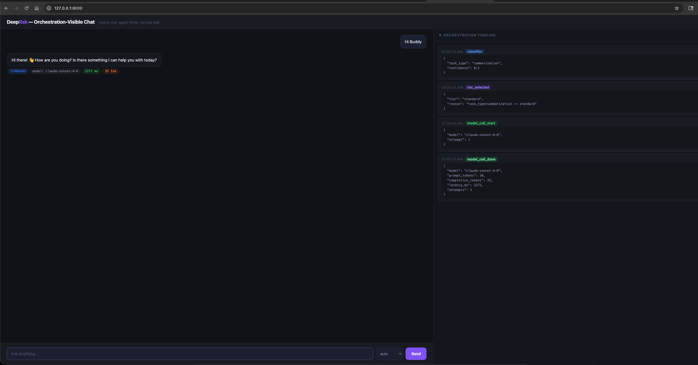

# DeepRak

> **An open-source agentic AI runtime for penetration testing — small, focused, OWASP APTS-aligned, ready to fork.**

DeepRak is a small Python library for building **autonomous AI pentest agents**. It picks the right-sized model per task, retrieves from a local Markdown knowledge base without a vector database, falls back across providers when one is rate-limited, and surfaces every routing decision to the operator in real time.

It's intentionally **small** so you can read it end-to-end in an afternoon, fork it, and adapt it to your own pentest workflow without wading through framework noise.



---

## What's in scope

- **Tier-aware model delegation** — recon and parsing → small/cheap models. Threat reasoning and attack-chain synthesis → premium models. The choice is visible per request.
- **Local Markdown RAG** — point it at your CVE notes, prior-engagement findings, OWASP playbooks. Grep-based, no vector DB to operate. ([ADR-001](docs/design-decisions/ADR-001-no-vector-db.md))
- **Multi-provider, multi-model fallback** — OpenAI, Anthropic via LiteLLM, Google Gemini direct, Azure OpenAI, AWS Bedrock, or local Ollama.
- **Reference chatbot** — FastAPI + SSE + vanilla JS, ~700 lines total. Streams every routing step to the browser.
- **Adaptive skills** — pentest playbooks as Markdown ([`examples/skills/`](examples/skills/)) with explicit pre/post-engagement hooks.

## What's out of scope (deliberately)

- No web UI in the runtime ([ADR-002](docs/design-decisions/ADR-002-no-ui.md))
- No vector database ([ADR-001](docs/design-decisions/ADR-001-no-vector-db.md), [ADR-004](docs/design-decisions/ADR-004-grep-over-embeddings-at-small-scale.md))
- No bundled model gateway — bring your own ([ADR-003](docs/design-decisions/ADR-003-litellm-as-gateway.md))
- No multi-agent topologies in v0.2

This is a runtime you compose into your own pentest tooling, not a framework that wants to own your stack.

---

## OWASP APTS alignment

DeepRak v0.2 ships primitives that map onto OWASP APTS (Autonomous Penetration Testing Standard) control areas:

| OWASP APTS area | DeepRak primitive |
|---|---|
| Scope enforcement (SE) | `RAGFilter` for scope-bounded retrieval over your engagement-specific corpus |
| Stable continuity (SC) | Multi-model fallback per tier; retry-with-exponential-backoff on transient errors |
| Auditable response (AR) | Every `DelegateResponse` records `model`, `tier`, `task_type`, `attempts`, `prompt_tokens`, `completion_tokens`, `latency_ms` |
| Model reliability (MR) | Deterministic classifier; structured response shape; tier-resolution priority |
| Transparency / Provenance (TP) | The reference chatbot streams every routing step to the UI; every reply carries the model identity |
| Reporting (RP) | Typed response objects suitable for downstream report generation |

Full APTS compliance is a property of the *system you build with DeepRak*, not of DeepRak alone. The runtime gives you the primitives; you wire them into your audit log, approval channel, and dual-model QC.

---

## Setup (5 minutes, any OS)

### Prerequisites

| Need | Check |
|---|---|
| Python 3.11+ | `python3 --version` (macOS/Linux) or `python --version` (Windows) |
| Git | `git --version` |
| One AI access method | OpenAI API key, Anthropic key (via LiteLLM proxy), Gemini API key, or [Ollama](https://ollama.ai/) |

### Steps

```bash
# 1. Clone
git clone https://github.com/radhakrishnanrx/DeepRak-AI.git
cd DeepRak-AI

# 2. Install (macOS/Linux)
python3 -m venv .venv
source .venv/bin/activate
pip install -e ".[chatbot]"

# Windows PowerShell:
#   python -m venv .venv
#   .venv\Scripts\Activate.ps1
#   pip install -e ".[chatbot]"

# 3. Configure (pick ONE provider — all use the same env vars)
```

**OpenAI direct:**
```bash
export DEEPRAK_GATEWAY_URL="https://api.openai.com"
export DEEPRAK_API_KEY="sk-..."
export DEEPRAK_MODEL_SMALL="gpt-4o-mini"
export DEEPRAK_MODEL_STANDARD="gpt-4o"
export DEEPRAK_MODEL_PREMIUM="gpt-4o"
```

**Google Gemini direct (no proxy):**
```bash
export DEEPRAK_GATEWAY_URL="https://generativelanguage.googleapis.com"
export DEEPRAK_GATEWAY_PATH="/v1beta/openai/chat/completions"
export DEEPRAK_API_KEY="<gemini-api-key>"
export DEEPRAK_MODEL_SMALL="gemini-2.5-flash-lite"
export DEEPRAK_MODEL_STANDARD="gemini-2.5-flash"
export DEEPRAK_MODEL_PREMIUM="gemini-2.5-pro"
```

**Local Ollama (free, no cloud):**
```bash
export DEEPRAK_GATEWAY_URL="http://localhost:11434/v1"
export DEEPRAK_API_KEY="ollama"
export DEEPRAK_MODEL_SMALL="phi3"
export DEEPRAK_MODEL_STANDARD="llama3"
export DEEPRAK_MODEL_PREMIUM="llama3"
```

```bash
# 4. Run
python examples/chatbot/server.py

# 5. Open http://127.0.0.1:8000
```

> Windows: use `$env:DEEPRAK_GATEWAY_URL="..."` etc. for the env vars.

---

## See it work

Try these prompts and watch the right-hand orchestration timeline:

| Prompt | Expected tier |
|---|---|
| `Extract CVE IDs from: CVE-2026-25592, CVE-2026-41679` | **SMALL** (parsing) |
| `Summarize the OWASP Top 10 for Agentic Applications 2026` | **STANDARD** |
| `Plan a threat-modeling approach for an MCP-server-using agent` | **PREMIUM** (synthesis) |

Every reply shows model · tier · latency · tokens · attempts.

---

## Use it as a library

```python
from deeprak.delegate import (
    DelegateRequest, LiteLLMAdapter, ModelRouter, ModelTier, TierConfig,
)

adapter = LiteLLMAdapter(
    base_url="http://localhost:4000",
    api_key="your-key",
)

router = ModelRouter(
    tier_configs={
        ModelTier.SMALL:    TierConfig(tier=ModelTier.SMALL,    models=["gpt-4o-mini"]),
        ModelTier.STANDARD: TierConfig(tier=ModelTier.STANDARD, models=["gpt-4o"]),
        ModelTier.PREMIUM:  TierConfig(tier=ModelTier.PREMIUM,  models=["claude-3-5-sonnet-20241022"]),
    },
    adapter=adapter,
)

response = router.route(DelegateRequest(prompt="Summarize CVE-2026-25592."))
print(response.content, "  (model:", response.model, " latency:", response.latency_ms, "ms)")
```

---

## Project shape

```
deeprak/
├── delegate/                      Tier-aware model routing (the core)
└── rag/                           Local Markdown retrieval (no vector DB)

examples/
├── chatbot/                       FastAPI + SSE reference chatbot
└── skills/                        Pentest playbooks (Markdown)
    ├── rag-corpus-audit.md        Audit a docs corpus before plugging into RAG
    ├── agentic-threat-modeling.md STRIDE+PASTA extended for agentic systems
    └── ai-supply-chain-sbom-aibom.md SBOM/AIBOM for AI components

docs/design-decisions/             5 ADRs documenting the no's
```

---

## Fork and develop further

DeepRak is a starting point, not a destination. Fork it, add your own skills under `examples/skills/`, swap the chatbot UI for whatever fits your workflow, wire the orchestrator into your audit pipeline. The runtime stays small so you can read it, understand it, and extend it without fighting a framework.

When you build something useful on top, open an issue or a Discussion — the maintainer is interested in seeing how this gets used.

---

## Learn more

- **[ARCHITECTURE.md](ARCHITECTURE.md)** — design principles, module map, adaptive-skill lifecycle
- **[docs/design-decisions/](docs/design-decisions/)** — 5 ADRs (no vector DB, no UI, LiteLLM gateway, grep over embeddings, chat UI in examples)
- **[SECURITY.md](SECURITY.md)** — security posture, OWASP LLM Top 10 alignment, vulnerability reporting
- **[CONTRIBUTING.md](CONTRIBUTING.md)** — how to contribute

---

## License

[MIT](LICENSE) — fork it, ship it, attribution appreciated.
